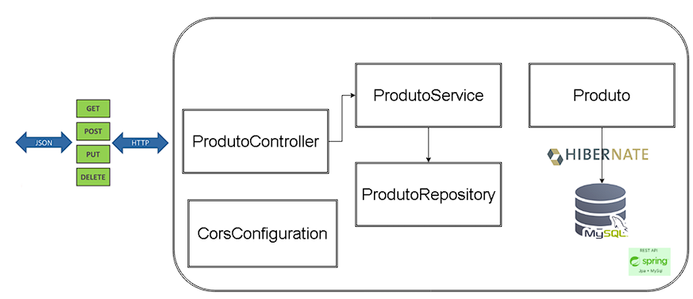
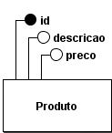
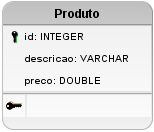

# Projeto

Este projeto foi desenvolvido durante as aulas de Desenvolvimento de Sistemas, visando demonstrar os benefícios da utilização de uma arquitetura que separa a aplicação do servidor (Back-End) da aplicação consumidora (Front-End), benefícios como:
* **Baixo Esforço de Manutenção**.
* **Alto Pontencial de Reuso**.
* **Baixo Acoplamento**, permitindo **Independênia de Tecnologias** entre as partes do sistema. 

Esta aplicação representa o Back-End do sistema e foi desenvolvida como uma API REST. Ela permite realizar operações de CRUD sobre uma entidade fictícia chamada Produto. As operações podem ser acessadas por meio de 5 End-Points, descritos na [Seção End-Points](#end-points).

Para o desenvolvimento da aplicação foram utilizadas as seguintes tecnologias:
* **Spring Framework**;
* **JPA**;
* **Hibernate**; e 
* **PostgreSQL**. 

## Arquitetura da Aplicação
O Back-End foi desenvolvido utilizando uma arquitetura de camadas, para separar e definir as  responsabilidades das classes que compõem a aplicação. 

As camadas definidas foram:
* **Controller**: Intemedia a comunicação entre o mundo externo com as demais camadas da aplicação.
* **Service**: Implementa as regras de negócio da aplicação.
* **Entity**: Mapeia as classes do domínio para tabelas no banco dados. 
* **Repository**: Implementa as operações CRUD referentes às classes da camada Entity.
* **Configuration**: Define configurações específicas do Framework Spring. 

As camadas foram organizadas em pacotes de mesmo nome, esses estão localizados em:

```
/src/main/java/devapp/crud_produto/
```

### Diagrama: Arquiterura da Aplicação
<p align=center>
    
</p>  

## Modelagem do Banco de Dados

|                     Modelo Conceitual                      |                    Modelo Lógico                     |
|:------------------------------------------------------------:|:----------------------------------------------------:|
|  |  |

## End-Points
Os End-Points da aplicação estão associados a 5 operações: 
* [Consultar Todos](#operação-consultar-todos).
* [Consultar por ID](#operação-consultar-por-ID).
* [Cadastrar](#operação-cadastrar).
* [Atualizar](#operação-atualizar).
* [Remover](#operação-deletar).

### Operação: Consultar Todos
[End-Points](#end-points)
* URL: `http://localhost:8080/produto/listall`.
* Verbo HTTP: `GET`.
* Parâmetros: `N/A`.
* Corpo da Requisição: `null`.

Cenário de Sucesso:
* Código: `200 OK`.
  * Corpo da Resposta: `JSON`.
      ```json
      [
          {
              "id": 1,
              "descricao": "Produto 1",
              "preco": 1.0,
              "fornecedor": "Fornecedor 1",
              "qtdestoque": 1
          },
          {
              "id": 2,
              "descricao": "Produto 2",
              "preco": 2.0,
              "fornecedor": "Fornecedor 2",
              "qtdestoque": 1
          },
          {
              "id": 1,
              "descricao": "Produto 3",
              "preco": 1.0,
              "fornecedor": "Fornecedor 3",
              "qtdestoque": 1
          }
      ]
      ``` 

<hr>

### Operação: Consultar por ID
[End-Points](#end-points)
* URL: `http://localhost:8080/produto/list/{ID}`.
* Verbo HTTP: `GET`.
* Parâmetros:
    * `ID`: ID do produto a ser consultado.
* Corpo da Requisição: `null`.

Cenário de Sucesso:
* Código: `200 OK`.
* Corpo da Resposta: `JSON`.
    ```json
    {
        "id": 1,
        "descricao": "Produto 1",
        "preco": 1.0,
        "fornecedor": "Fornecedor 1",
        "qtdestoque": 1
    }
    ```

Cenário de Falha:
* Código: `404 NOT FOUND`.
* Corpo da Resposta: `null`.

<hr>

### Operação: Cadastrar
[End-Points](#end-points)
* URL: `http://localhost:8080/produto/add`.
* Verbo HTTP: `POST`.
* Parâmetros: `N/A`.
* Corpo da Requisição: 
    ```json
    {
        "descricao": "Produto 1",
        "preco": 1.0,
        "fornecedor": "Fornecedor 1",
        "qtdestoque": 1
    }
    ```

Cenário de Sucesso:
* Código: `201 CREATED`.
* Corpo da Resposta: `null`.

<hr>

### Operação: Atualizar
[End-Points](#end-points)
* URL: `http://localhost:8080/produto/update`.
* Verbo HTTP: `PUT`.
* Parâmetros: `N/A`.
* Corpo da Requisição: `JSON`.
    ```json
    {
        "id": 1,
        "descricao": "Produto 1",
        "preco": 1.0,
        "fornecedor": "",
        "qtdestoque": 1
    }
    ```

Cenário de Sucesso:
* Código: `201 CREATED`.
* Corpo da Resposta: `JSON`.
    ```json
    {
        "id": 2,
        "descricao": "O Conde de Monte Cristo",
        "preco": 54.83,
        "fornecedor": "",
        "qtdestoque": 1
    }
    ```

Cenário de Falha:
* Código: `404 NOT FOUND`.
* Corpo da Resposta: `null`.

<hr>

### Operação: Deletar
[End-Points](#end-points)
* URL: `http://localhost:8080/produto/delete/{ID}`.
* Verbo HTTP: `DELETE`.
* Parâmetros:
    * `ID`: ID do produto a ser deletado.
* Corpo da Requisição: `null`.

Cenário de Sucesso:
* Código: `204 NO CONTENT`.
* Corpo da Resposta: `null`.

Cenário de Falha:
* Código: `404 NOT FOUND`.
* Corpo da Resposta: `null`.